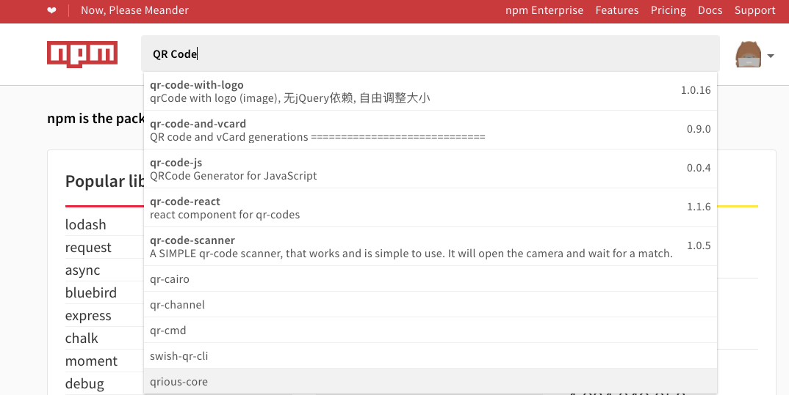
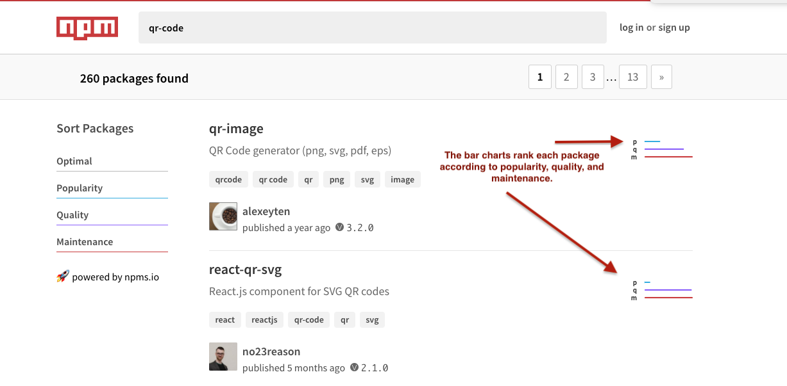

<!--
title: 02 - How to find & select packages
featured: true
-->

# Finding and Selecting Packages

To find packages, start with the npm [search bar](https://www.npmjs.com).

## Example: Finding a Package

For example, suppose you wanted to use bar codes (QR codes) in your application. Rather than spend weeks figuring out how to do this, why not see if someone has posted a package that creates QR codes? Start by entering a value in the search bar:

<!-- -->

As you type, possible choices appear: 

<!--  -->

### How to Choose Between Similar Packages 

After entering a search term in the search bar, press Enter to see rankings that will help you choose between similar packages:

<!--  -->

Often, there are dozens or even hundreds of packages with similar names and/or similar purposes. To help you decide the best ones to explore, each package has been ranked according to four criteria using the **npms analyzer**: 

* Optimal
* Popularity
* Quality
* Maintenance

**Popularity** indicates how many times the package has been downloaded. This is a good indicator of packages that others have found to be especially useful, but not foolproof.

**Quality**  includes considerations such as the presence of a readme file, stability, tests, up-to-date dependencies, custom website, and code complexity. 

**Maintenance** ranks packages according to the attention given by developers. Packages that are maintained more frequently are more likely to work well with the current or upcoming versions of npm, for example. 

**Optimal** combines the three other criteria in a meaningful way. 

To list packages according to a specific criteria, click its label under `Sort Packages`. For example, to search by Popularity, click `Popularity`. 

<!--  -->

### The Package Page 

When you choose a package, more information appears. This information is written by the package author(s) so details vary. This is where you can discover how to use this package. Developers often provide contact information as well. 

#### Download a package

The next chapter explains how to install npm. After you install npm, you will use a terminal console to download packages. This is explained in later chapters.

## Learn More
For more information about how npms and the npms analyzer work, click [here](https://npms.io/about).  

