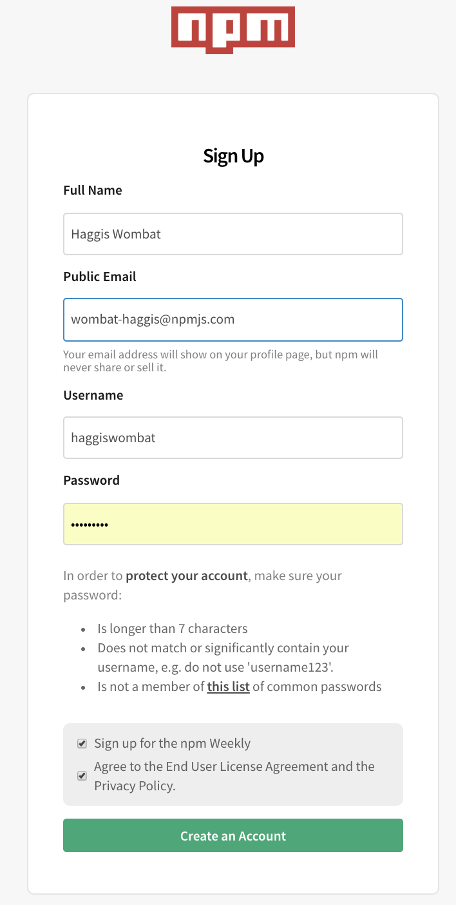
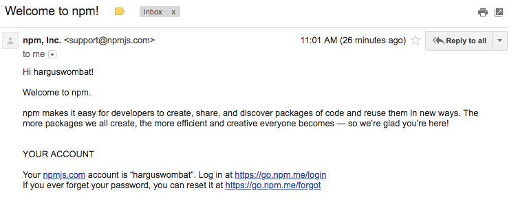

<!--
title: 02 - Setting Up Your Account and Installing node and npm 
featured: true
-->
#Setting up npm 

There are two steps to setting up npm account for the first time.

1. Set up your npm account from a web broswer using http://www.npmjs.com.

2. Download nodejs and npm from a terminal console, then sign on using your new account. 
3. 
3. If you prefer using the command line interface (CLI) jump to the end of this chapter.

## How to sign up for npm from the web

### Create an npm account 

1. Go to http://www.npmjs.com and click 'log in'.

2. Fill in the sign up page.  

*Full Name* First and Last Name. (You can enter middle name(s) as well).

*Public Email* Enter an email account. This email address will be added to the metadata when you publish a package. This means that the email address can be discovered by anyone who downloads your packages. In addition, npm will send email to this acccount when you update packages. Developers who expect to publish frequently may wish to create a special email to use for interacting with npm (and possibly, for interacting with those who detect your email address from the metadata of packages that they download.)  

*Username* Enter a username. This will be what you are known by in the npm world. Pick a name you will be happy with for a long time, that doesnt violate our policy guidelines. The name must be lower case. It can have dashes and numerals. 

*password*

When you have filled in your information, click `Create an Account`. 

2. Open the public email address that you entered.  

3. Find the welcome message from npm (please search All Mail if using Gmail). 

_The welcome message has links to helpful resources; you might want to flag it for later reference._ 

Click the first link under the Account heading to validate your account.

 
Click `Create an Organization` from the menu.
 
 
_If you can't find the welcome message, please click to resend:_  

 

## Related CLI Commands 

Some of us prefer working with the command line interface (CLI) in a terminal console, to using browsers. So, here are some related CLI commands: 

### [npm adduser](https://doc.npmjs.com/cli/adduser)

### [npm profile set](https://doc.npmjs.com/cli/profile)

